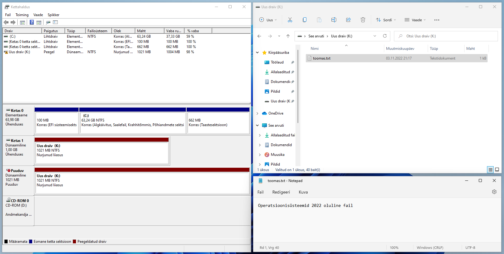
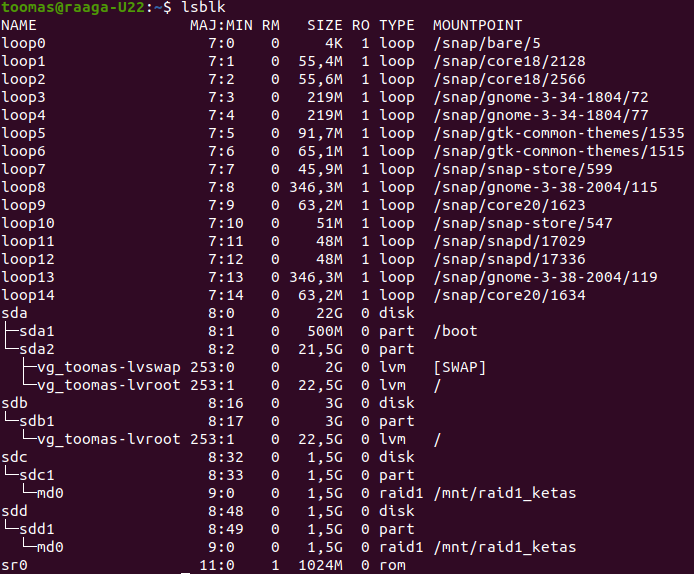
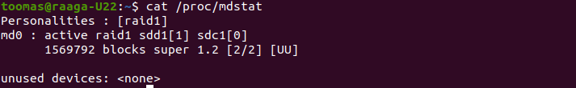
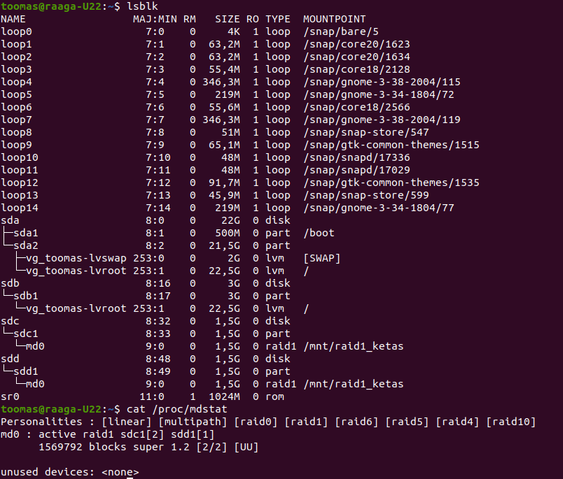
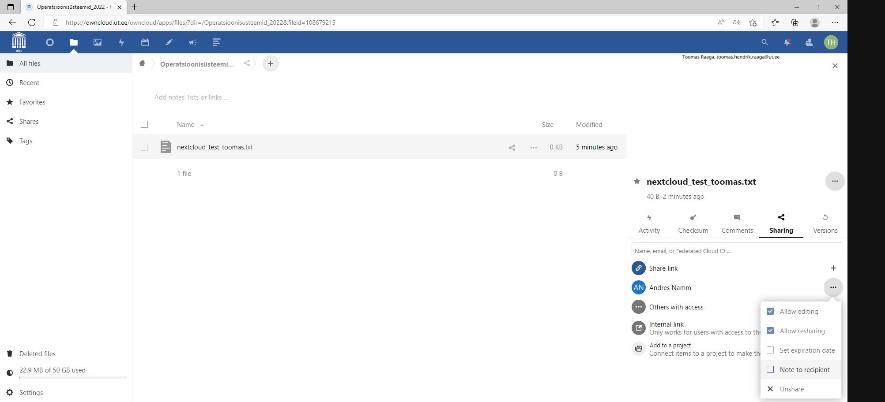
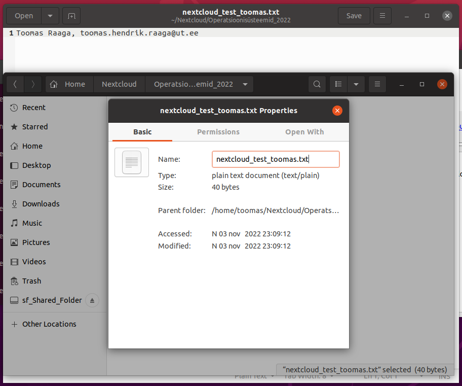
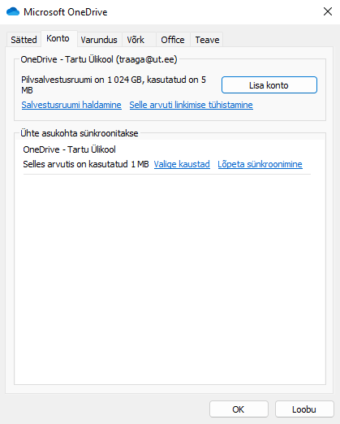

1. Windows RAID 1 ülesandes 5 tehtud ekraanipildid.
   
   - Käivitage Windows 11 kettahalduse tööriist (disk management) ning tehke ekraanipilt tervest (`k:`) ja katkisest (nurjunud liiasus) kettast.
     
     

2. Linux RAID 1 ülesandes 5 tehtud ekraanipidid.
   
   - (Lisage vikilehele ekraanipildid käskude `lsblk` ja `cat /proc/mdstat` väljunditest)
     
     
     
     

3. Linux RAID 1 ülesandes 10 tehtud ekraanipildid.
   
   - (Lisage vikilehele ekraanipildid käskude `lsblk` ja `cat /proc/mdstat` väljunditest)
     
     

4. Nextcloud ülesandes tehtud ekraanipildid (2tk: `Windows` ja `Ubuntu` mõlemad)
   
   - (Lisage oma vikilehele ekraanipildid Nextcloud ülesandest nii `Windows`i kui `Ubuntu` all)
     
     
     
     

5. Esitage ekraanivaade tõestamaks, et teil on olemas aktiivne OneDrive failide sünkroniseerimine kohaliku arvuti ja pilveandmete vahel. `Settings` -> `Account` vaheleht.
   
   